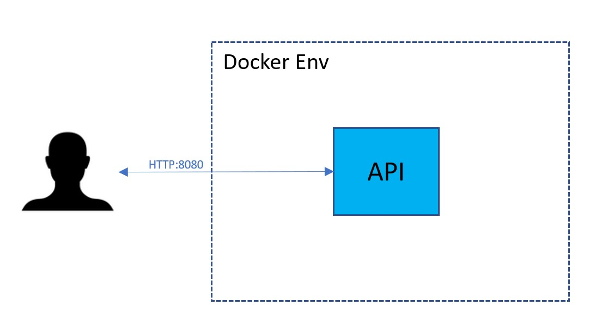
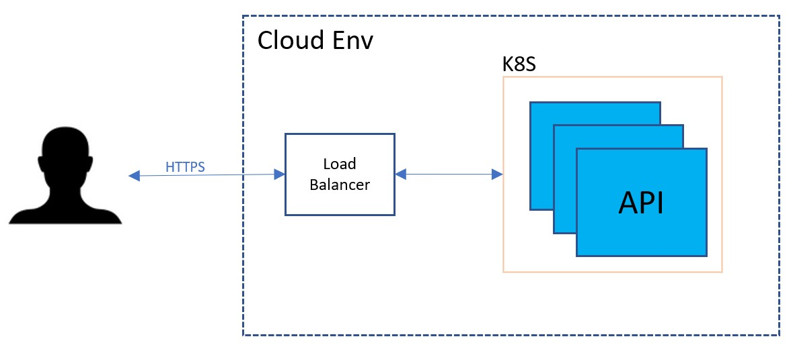
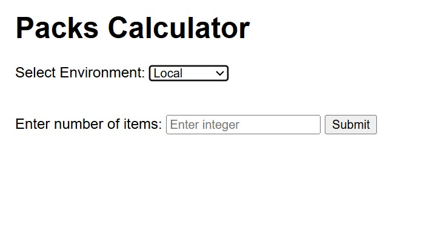
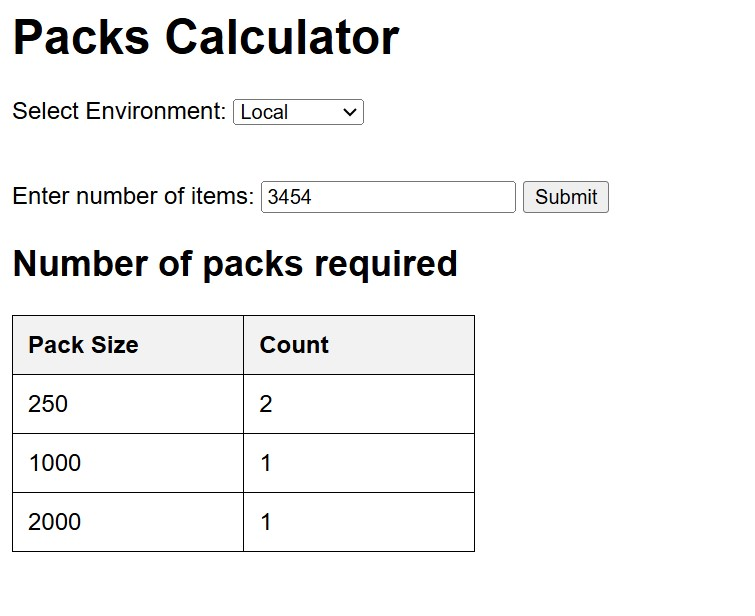
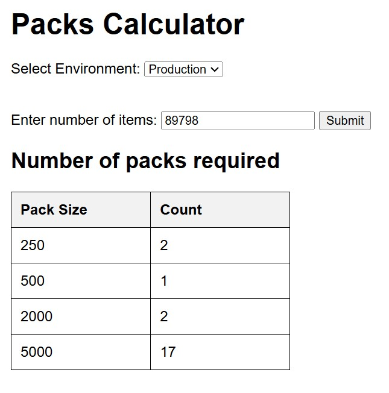

# gsapi

## Introduction
REST API to calculate the number packs for the number of items

## Architecture

### Local


### Cloud(Next Iteration)



## API
```
# Get the packs 

POST /api/v1/packs-for-items --data '{"items": $NUMER_OF_ITEMS}'
```

## Code Organization

    - cmd - Main & Binaries
        main.go
        - bin
            - gsapi
    - config - config data
        - .env
    - internal
        - handlers - API Endpoint handlers
        - server - server and routes
    Dockerfile
    go.mod
    go.sum
    Makefile
    README.md

## Build

```bash
  make build_local
  make docker_build
```

## Run Locally
Assumption - postgres DB is already running locally
```bash
  cp sample.env .env
  ./cmd/bin/gsapi
```

## Running Tests

To run tests, run the following command

```bash
  make test
```

## UI

Run the UI/ui.html and select the environment.





